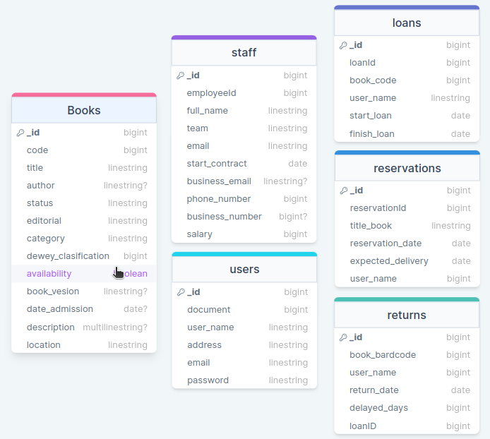

# Library

Este proyecto consiste en un programa que se encarga de administrar una librería. Se generará basado a una problemática real que pueden sufrir diferentes bibliotecas. Se generará tanto el front como el back.


La organización del trabajo se está realizando en el siguiente notion: 
```href
    https://www.notion.so/invite/680af7ec53825f68198799ede42595bd3805cb2c
```

## Diagrama de la base de datos:


## Creación de un nuevo usuario (SingUp)

Para la creación de un nuevo usuario en la base de datos se debe acceder a esta ruta: 
```http
POST http://192.168.129.72:5108/singUp
```
* Para la correcta creación se debe enviar el siguiente cuerpo:
```json
{
    "documento": 1005343533,
    "nombre": "Usuario Nuevo",
    "direccion": "Direccion 123",
    "correo": "correo123@gmail.com",
    "contraseña": "contraseña"
}
```
Este endPoint valida que el correo que se está ingresando no exista o no exista ningún documento con dicho dato. 

Al crear el usuario también devuelve el token de acceso, por lo que puede utilizarlo para realizar las consultas siguientes.


## Creación del token de acceso
Para la generación del token de acceso se debe usar esta ruta:
```http
POST http://192.168.129.72:5108/login
```
* Se debe enviar el siguiente cuerpo (debe enviar un dato que ya haya sido creado anteriormente en la base de datos): 
    ```json
    {
        "correo": "davidarueda18@gmail.com",
        "contraseña": "eeeee"
    }
    ```

## Consultas específicas del proyecto: 

###

**Crud**

1. Crud de la colección de libros: 
```http
ALL http://192.168.129.72:5108/api/use/books?code=...
```
Para lo métodos PUT, DELETE y GET by Code se debe enviar como pará metro el valor del códgi del libro al que se le desea realizar la consulta.

El cuerpo para realizar el ingreso de los datos es el siguiente:
```json 
{ 
    "codigo": 1234,
    "titulo": "Reina de picas",
    "author": "Isador",
    "estado": "Antiguo",
    "editorial": "Norma",
    "categoria": "Drama",
    "clasificacion_Dewey": 820,
    "disponibilidad": true,
    "version": "version especial",
    "ingreso": "2015-06-31",
    "descripcion": "Es un libro sobre estrategis del poker",
    "ubicacion": "Literatura general"
} 
```
Para el método PUT no es necesario enviar todo el cuerpo si no unicamete los datos que se requieren modificar (usando la misma notación el JSON de arriba).


2. Crud de la colección de Loans (prestamos): 

*Se recomienda NO utilizar este endPoint para realizar los prestamos ya que hay un método que realiza transacciones internas y permite un mejor ingreso de prestamos.*
```http
ALL http://192.168.129.72:5108/api/use/loans?id_loan=...
```
Para lo métodos PUT, DELETE y GET by id_loan se debe enviar como pará metro el valor del códgi del libro al que se le desea realizar la consulta.

El cuerpo para realizar el ingreso de los datos es el siguiente:
```json 

/* Obligatorios */
  { 
      "codigo_libro": 1234,
      "nombre_usuario": "David Andrés Rueda",
      "finalizacion_prestamo": "2023-10-21"
  } 
/* Con valores opcionales */

  { 
      "reservationId": 21,
      "codigo_libro": 1234,
      "nombre_usuario": "David Andrés Rueda",
      "finalizacion_prestamo": "2023-10-21"
  } 

```
Para el método PUT no es necesario enviar todo el cuerpo si no unicamete los datos que se requieren modificar (usando la misma notación el JSON de arriba).

3. Crud de la colección de Reservations: 

*Se recomienda NO utilizar este endPoint para realizar las reservaciones ya que hay un método que realiza transacciones internas y permite un mejor ingreso de las reservas.*
```http
ALL http://192.168.129.72:5108/api/use/reservations?id_reservation=...
```
Para lo métodos PUT, DELETE y GET by id_reservation se debe enviar como pará metro el valor del id del prestamo libro al que se le desea realizar la consulta.

El cuerpo para realizar el ingreso de los datos es el siguiente:
```json 
{ 

    "titulo": "rey de picas",
    "nombre_usuario": "David Andrés Rueda",
    "entrega_esperada": "2023-10-21"
  
} 
```
Para el método PUT no es necesario enviar todo el cuerpo si no unicamete los datos que se requieren modificar (usando la misma notación el JSON de arriba).

4. Crud de la colección de Returns: 

*Se recomienda PARA NADA utilizar este endPoint para realizar las retornos ya que hay un método que realiza transacciones internas VERIFICANDO DATOS y permite un mejor ingreso de los retornos.*
```http
ALL http://192.168.129.72:5108/api/use/returns?code=...
```
Para lo métodos PUT, DELETE y GET by code se debe enviar como parámetro el valor del id del prestamo al que se le desea realizar la consulta.

El cuerpo para realizar el ingreso de los datos es el siguiente:
```json 
  { 
      "id": 54,
      "codigo_libro": 1,
      "nombre_usuario": "David Andrés Rueda",
      "finalizacion_prestamo": "2023-10-21"
  } 
```
Para el método PUT no es necesario enviar todo el cuerpo si no unicamete los datos que se requieren modificar (usando la misma notación el JSON de arriba).

5. Crud de la colección de Users: 
```http
ALL http://192.168.129.72:5108/api/use/users?id=...
```

Para el cuerpo de la consulta se recomienda observar el otorgado para el singUp. (se recomienda usar el endPoint del singUp para el post de usuarios ya que valida y evita que se repitan correos).


6. Crud de la colección de Staff: 

```http
ALL http://192.168.129.72:5108/api/use/staff?id_employee=...
```
Para lo métodos PUT, DELETE y GET by id_employee se debe enviar como parámetro el valor del id_employee del staff al que se le desea realizar la consulta.

El cuerpo para realizar el ingreso de los datos es el siguiente:
```json 
{
    "id_staff": 212,
    "nombre": "Pepo",
    "equipo": "Equipo De Abogados",
    "correo": "correo@gmail.com",
    "correo_corporativo": "correodfdsf@gmail.com",
    "telefono": 3023400000,
    "telefono_corporativo": 3120000000,
    "salario": 6000000,
    "inicio_contrato": "2021-09-23"
}
```
Para el método PUT no es necesario enviar todo el cuerpo si no unicamete los datos que se requieren modificar (usando la misma notación el JSON de arriba).


### Consultas:

**Books**:

1. Endpoint que permita filtrar libros por titulo.
```http
GET http://192.168.129.72:5108/api/use/bookTitle?name=...
```
Este endPoint necesita el envío de un parámetro: *param: name*.

2. Filtrar todos los libros por autor.
```http
GET http://192.168.129.72:5108/api/use/bookAuthor?name=...
```
Este endPoint necesita el envío de un parámetro: *param: name*.

3. Mostrar los libros agrupados por autores, de forma que se puedan observar todos los libros que tiene cada autor.
```http
GET http://192.168.129.72:5108/api/use/booksByAuthor
```

4. mostrar todos los libros por su disponibilidad. True si está disponible y false si no.
```http
GET http://192.168.129.72:5108/api/use/bookAviability?state=...
```

Este endPoint necesita el envío de un parámetro: *param: state*.

5. mostrar todos los libros agrupados por su clasificación de dewey. 
```http
GET http://192.168.129.72:5108/api/use/bookDewey
```
6. Mostrar los libros agrupados por su ubicación en la biblioteca.
```http
GET http://192.168.129.72:5108/api/use/bookLocation?place=...
```
Este endPoint necesita el envío de un parámetro: *param: place*.

7. mostrar todos los libros de una editorial específica.
```http
GET http://192.168.129.72:5108/api/use/bookEditorial
```

8. mostrar todos los libros que tengan una antiguedad de más de 5 años
```http
GET http://192.168.129.72:5108/api/use/
```

9. mostrar los libros ingresados en el 2023.
```http
GET http://192.168.129.72:5108/api/use/bookYear?year=...
```
Este endPoint necesita el envío de un parámetro: *param: year*.

10. mostrar los libros en mal estado.
```http
GET http://192.168.129.72:5108/api/use/bookStatus?status=...
```
Este endPoint necesita el envío de un parámetro: *param: status*.

Reservations:

11. Mostrar todas las reservaciones agendadas que hay para un libro con un titulo en específico 
```http
GET http://192.168.129.72:5108/api/use/reservationByTitle?name=...
```
Este endPoint necesita el envío de un parámetro: *param: name*.

12. mostrar todas las reservaciones que llevan N meses en espera
```http
GET http://192.168.129.72:5108/api/use/reservationByMonth?month=...
```
Este endPoint necesita el envío de un parámetro: *param: month*.

13. mostrar todas las reservaciones realizadas por una persona en específico
```http
GET http://192.168.129.72:5108/api/use/reservationByName?name=...
```
Este endPoint necesita el envío de un parámetro: *param: name*.

14.  EndPoint que al hacer un post de una reservación, verifica si existe algún libro con ese titulo disponible. En caso de que haya alguno disponible realice el prestamo inmediatamente (y cambie la disponibilidad del libro).  Si no existe ningún libro disponible, busca el prestamo cuya entrega esté más proxima y le asigna esa fecha de entrega 
```http
POST http://192.168.129.72:5108/api/use/reservationReal
```
* El cuerpo que se debe enviar es el siguiente: 
    ```json
    {
        "titulo": "The Origins of Species", //Titulo del libro que se desea buscar. 
        "nombre_usuario": "Luisa Pérez" // Usuario que desea hacer la reservación
    }
    ```
Hay cierta flexibilidad con el nombre del libro, se pueden escribir sin mayusculas y la consulta retornará el libro que más se parezca. Por ejemplo, si busco el libro "cien añ" va a encontrar el libro "cien años de soledad".

15. Mostrar la persona que tenga más reservaciones activas
```http
GET http://192.168.129.72:5108/api/use/reservationTop
```
16. Mostrar el titulo de los libros con sus respectivas reservas ordenas de más reservas a menos reservas
```http
GET http://192.168.129.72:5108/api/use/reservationBookTop
```
17. listar todos los libros que no tienen ninguna reservación activa
```http
GET http://192.168.129.72:5108/api/use/booksFree
```

Loans: 

18.  Este endPoint valida el cuerpo de la solicitud. Si es una solicitud que contiene una reservacion o no. Valida la disponibilidad del libro y dependiendo de si se encuentra o no disponible realiza el prestamos, realiza una reserva o envía un mensaje en caso de ya tener una. (En sus subprocesos valida si el codigo de reservación es válido) También se encarga de eliminar las reservas cuando se realiza un prestamo y de modificar los estados del libro a ocupado.
```http
POST http://192.168.129.72:5108/api/use/loansReal
```
El cuerpo que se debe enviar es el siguiente: 

* Si hay una reservación activa:
    ```json
    {
        "reservationId": 12 //codigo de la reservación
    }
    ```
* Si no hay una reservación activa: 
    ```json
    {
         "titulo": "The Origins of Species", //Titulo del libro que se desea buscar. 
         "nombre_usuario": "Luisa Pérez" // Usuario que desea hacer la reservación
    }
    ```
19. Endpoint que permita listar a todas las personas que tengan más de dos prestamos a la vez
```http
GET http://192.168.129.72:5108/api/use/loansManyActive
```
20. Listar los prestamos que están atrasados en su entrega.
```http
GET http://192.168.129.72:5108/api/use/loanLate
```
21. mostrar cual es el libro con más prestamos activos.
```http
GET http://192.168.129.72:5108/api/use/loanTopBook
```

Returns

22. *Al realizar el post de un return es obligatorio que exista un prestamo activo relacionado, por lo que antes se verifica que esta condición se cumpla. Si no existe ningún prestamo activo manda un mensaje de alerta mencionando que no es posible realizar un retorno de un libro que no tenía ningún prestamo activo. Si existe el prestamo activo inserta el dato y elimina el registro de la colección de prestamos. Inmediatamente modifica el estado del libro que se encontraba en prestamo
```http
POST http://192.168.129.72:5108/api/use/returnReal
```
* El cuerpo que se debe enviar es el siguiente: 
    ```json
    {
        "id": 12 //codigo del prestamo que se retorna
    }
    ```
23. Traer el top 3 de los libros más prestados con el número de prestamos
```http
GET http://192.168.129.72:5108/api/use/returnTopBook
```
24. Obtener las 10 personas que más prestamos han hecho a la biblioteca
```http
GET http://192.168.129.72:5108/api/use/returnUserTop
```
25. Listar a todas las personas ordenadas desde la persona con más días de retraso en las entregas a la que menos tiene.
```http
GET http://192.168.129.72:5108/api/use/returnLate
```
26. Traer todos los retornos realizados por un mes específico
```http
GET http://192.168.129.72:5108/api/use/returnByMonth?month=...
```
Este endPoint necesita el envío de un parámetro: *param: month*.

Usuarios:

27. Traer información de los usuarios que tienen una reservación activa (traer por documento)
```http
GET http://192.168.129.72:5108/api/use/userReservationON?doc=...
```
Este endPoint necesita el envío de un parámetro: *param: doc*.

Staff: 

28. Mostrar los empleados ordenados por sus áreas de trabajos.
```http
GET http://192.168.129.72:5108/api/use/staffTeams
```
29. Traer ordenados los empleados por salario
```http
GET http://192.168.129.72:5108/api/use/staffSalary
```
30. Traer al empleado más antiguo de la biblioteca.
```http
GET http://192.168.129.72:5108/api/use/staffSeniority
```
31.  Listar las reservas que están pendientes en su entrega
```http
GET http://192.168.129.72:5108/api/use/reservationPending
```

32.  Traer el prestamo más proximo a entregar de un libro en específico
```http
GET http://192.168.129.72:5108/api/use/reservationNextActive?title=...
```
Este endPoint necesita el envío de un parámetro: *param: title*.

33. Traer un usuario por correo electronico
```http
GET http://192.168.129.72:5108/api/use/userByEmail?correo=...
```
Este endPoint necesita el envío de un parámetro: *param: correo*.