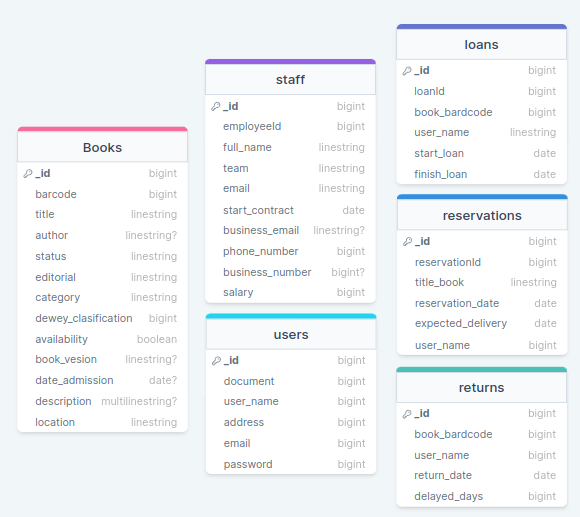

# library

Para el siguiente proyecto se está trabajando el siguiente grupo de trabajo de notion: 
```href
    https://www.notion.so/invite/680af7ec53825f68198799ede42595bd3805cb2c
```



Consultas específicas del proyecto: 

### Consultas:

Books:

1. Endpoint que permita filtrar libros por titulo.
2. Filtrar todos los libros por autor.
3. Mostrar los libros agrupados por autores, de forma que se puedan observar todos los libros que tiene cada autor.
4. mostrar todos los libros que en su estatus están disponibles.
5. mostrar todos los libros agrupados por su clasificación de dewey. 
6. Mostrar los libros agrupados por su ubicación en la biblioteca.
7. mostrar todos los libros de una editorial específica.
8. mostrar todos los libros que tengan una antiguedad de más de 5 años
9. mostrar los libros ingresados en el 2023.
10. mostrar los libros en mal estado.

Reservations:

11. Mostrar todas las reservaciones agendadas que hay para un libro con un titulo en específico 
12. mostrar todas las reservaciones que llevan más de 2 meses en espera
13. mostrar todas las reservaciones realizadas por una persona en específico
14.  EndPoint que al hacer un post de una reservación, verifica si existe algún libro con ese titulo disponible. En caso de que haya alguno disponible realice el prestamo inmediatamente (y cambie la disponibilidad del libro).  Si no existe ningún libro disponible, busca el prestamo cuya entrega esté más proxima y le asigna esa fecha de entrega.
15. Mostrar la persona que tenga más reservaciones activas
16. Mostrar el titulo de los libros con sus respectivas reservas ordenas de más reservas a menos reservas
17. listar todos los libros que no tienen ninguna reservación activa


Loans: 

18.  Este endPoint valida el cuerpo de la solicitud. Si es una solicitud que contiene una reservacion o no. Valida la disponibilidad del libro y dependiendo de si se encuentra o no disponible realiza el prestamos, realiza una reserva o envía un mensaje en caso de ya tener una. (En sus subprocesos valida si el codigo de reservación es válido) También se encarga de eliminar las reservas cuando se realiza un prestamo y de modificar los estados del libro a ocupado.
19. Endpoint que permita listar a todas las personas que tengan más de dos prestamos a la vez
20. Listar los prestamos que están atrasados en su entrega.
21. mostrar cual es el libro con más prestamos activos.

Returns

22. *Al realizar el post de un return es obligatorio que exista un prestamo activo relacionado, por lo que antes se verifica que esta condición se cumpla. Si no existe ningún prestamo activo manda un mensaje de alerta mencionando que no es posible realizar un retorno de un libro que no tenía ningún prestamo activo. Si existe el prestamo activo inserta el dato y elimina el registro de la colección de prestamos. Inmediatamente modifica el estado del libro que se encontraba en prestamo
23. Traer el top 3 de los libros más prestados con el número de prestamos
24. Obtener las 10 personas que más prestamos han hecho a la biblioteca
25. Listar a todas las personas ordenadas desde la persona con más días de retraso en las entregas a la que menos tiene.
26. Traer todos los retornos realizados por un mes específico

Usuarios:

27. Traer información de los usuarios que tienen una reservación activa (traer por documento)

Staff: 

28. Mostrar los empleados ordenados por sus áreas de trabajos.
29. Traer ordenados los empleados por salario
30. Traer al empleado más antiguo de la biblioteca.